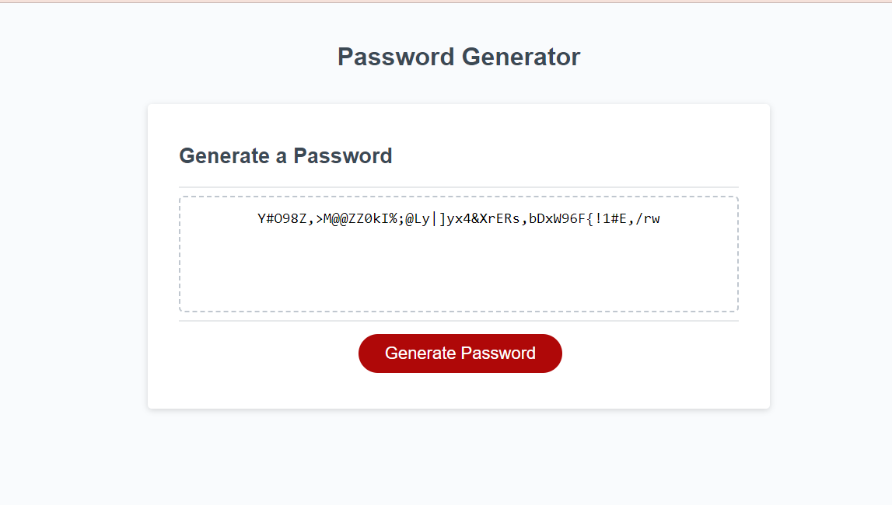

# PasswordGeneratorJS

## Description
This is a password generator that uses windows object to prompt the users to choose certain characteristics for their passwords.
Passowords are generated randomly using JavaScript.

[Deployed-web](https://yemnyfeliz.github.io/PasswordGeneratorJS/)

## Installation

N/A

## Usage

Users can create secure random passwords with this web application.

## Credits
Lesley Vaden advised me to used console.log to find issues with my code and fix them.

Starter code (html and css) was provided by full stack web development bootcamp program offered by Rutgers University.

Watched this youtubr video https://www.youtube.com/watch?v=v2jfGo7ztm8&t=1406s to get an idea of how to randomize arrays.

## License

Please refer to LICENSE in the repository.
